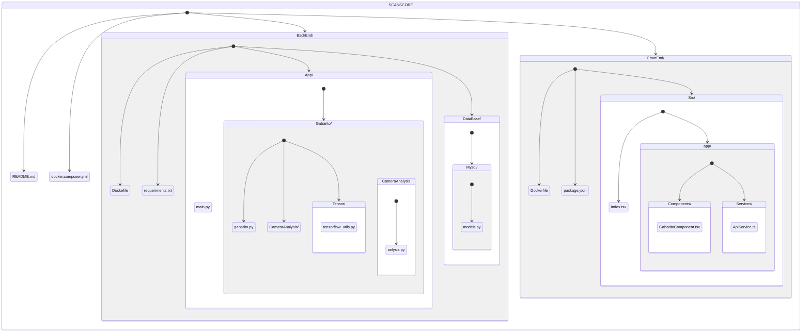

#  Structure of the application's folder organization.

```mermaid
stateDiagram-v2
    state SCANSCORE{
       [*]-->README.md
       [*]-->docker.composer.yml
       [*]-->BackEnd/
       [*]-->FrontEnd/

        state BackEnd/{
            [*]-->App/
             
            state App/{
                main.py
                [*]-->Gabarito/
                state Gabarito/{
                    [*]-->gabarito.py
                    [*]-->CameraAnalysis/
                    state CameraAnalysis{
                        [*]-->anlysis.py
                    }
                    [*]-->Tensor/
                    state Tensor/{
                        tensorflow_utils.py
                    }
                }
            }
            [*]-->DataBase/
            state DataBase/{
                [*]-->Mysql/
                
                state Mysql/{
                    [*]-->models.py
                }
            }
            [*]-->Dockefile
            [*]-->requeriments.txt
    }
    state FrontEnd/{
        [*]-->Src/
        [*]-->Dockerfile
        [*]-->package.json

        state Src/{
            [*]-->index.tsx
            [*]-->app/

            state app/{
                [*]-->Components/
                [*]-->Services/

                state Components/{
                    GabaritoComponent.tsx
                }
                state Services/{
                    ApiService.ts
                }
            }

        }
        
    }

}


```
