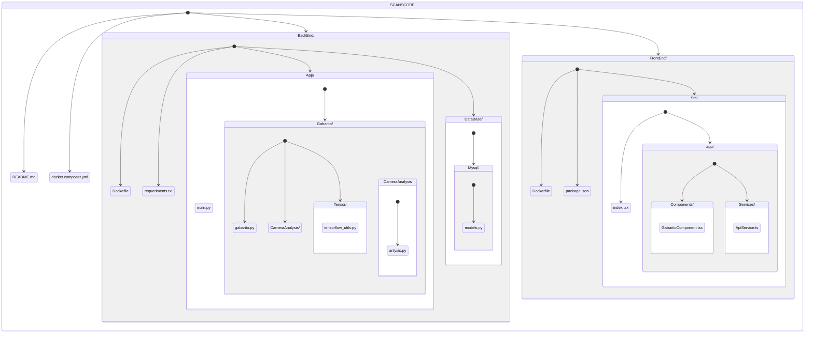

#  Structure of the application's folder organization.

Claro, aqui está uma descrição detalhada de cada pasta e arquivo no seu projeto, utilizando a formatação Markdown:

## `leitor_de_gabarito/`

Este é o diretório raiz do seu projeto.

### `backend/`

Contém a lógica do servidor e da API.

- #### `app/`
  - `__init__.py`: Arquivo de inicialização do módulo.
  - `main.py`: Arquivo principal para a configuração e execução do servidor.
  
  #### `gabarito/`
  - `__init__.py`: Arquivo de inicialização do módulo.
  - `gabarito.py`: Lógica relacionada ao processamento de gabaritos.
  
    ##### `camera_analysis/`
    - `__init__.py`: Arquivo de inicialização do módulo.
    - `analysis.py`: Funcionalidades para a análise da câmera.
  
    ##### `tensorflow/`
    - `__init__.py`: Arquivo de inicialização do módulo.
    - `tensorflow_utils.py`: Utilitários relacionados ao TensorFlow para a leitura de gabaritos.
  
  #### `database/`
  - `__init__.py`: Arquivo de inicialização do módulo.
  - `mysql/`
    - `__init__.py`: Arquivo de inicialização do módulo.
    - `models.py`: Definição dos modelos de dados relacionados ao MySQL.

- #### `Dockerfile`
  Arquivo de configuração para a criação de uma imagem Docker para o backend.

- #### `requirements.txt`
  Lista de dependências do Python necessárias para o backend.

### `frontend/`

Contém todo o código relacionado à interface do usuário.

- #### `src/`
  - #### `app/`
    - #### `components/`
      - `__init__.tsx`: Arquivo de inicialização do módulo.
      - `GabaritoComponent.tsx`: Componente relacionado à exibição e interação com os gabaritos.
    - #### `services/`
      - `__init__.tsx`: Arquivo de inicialização do módulo.
      - `ApiService.ts`: Serviço para interação com a API.

  - `index.tsx`: Ponto de entrada principal do frontend.

- #### `Dockerfile`
  Arquivo de configuração para a criação de uma imagem Docker para o frontend.

- #### `package.json`
  Configurações e dependências do projeto frontend.

## `docker-compose.yml`

Arquivo de configuração do Docker Compose, que define os serviços Docker e suas configurações para a sua aplicação.

## `README.md`

Arquivo de documentação do projeto, onde você pode fornecer informações sobre a instalação, configuração e uso do seu aplicativo.