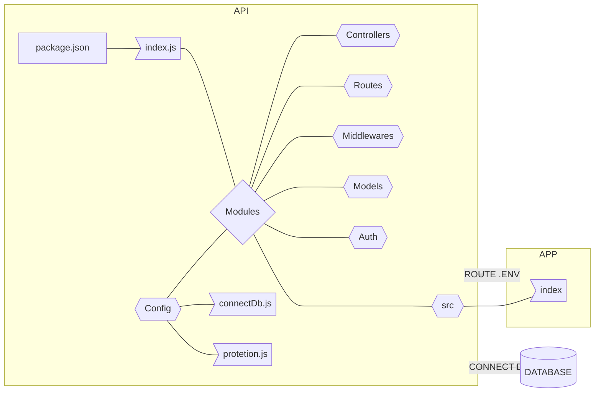

# leitor_de_gabarito

Esta aplicação tem como finalidade analisar e fazer a analise de desempenho de estudantes com base
no desempenho por eles obtidos em uma determinada avaliação. A ideia principal é fazer a contagem do gabarito 
apartir do uso da câmera do aparelho utilizará a tecnologia para ler o gabarito. 

## STACKS

### FRONTEND
1. Angular ou React ( estou a decidir)
2. Typescript no frontend

### BACKEND

1. FastAPi ou express( estou ainda a decidir)
2. Tensorflow para analise na camera;
3. Python para a leitura de Gabarito;

### DATABASE
1. mysql

